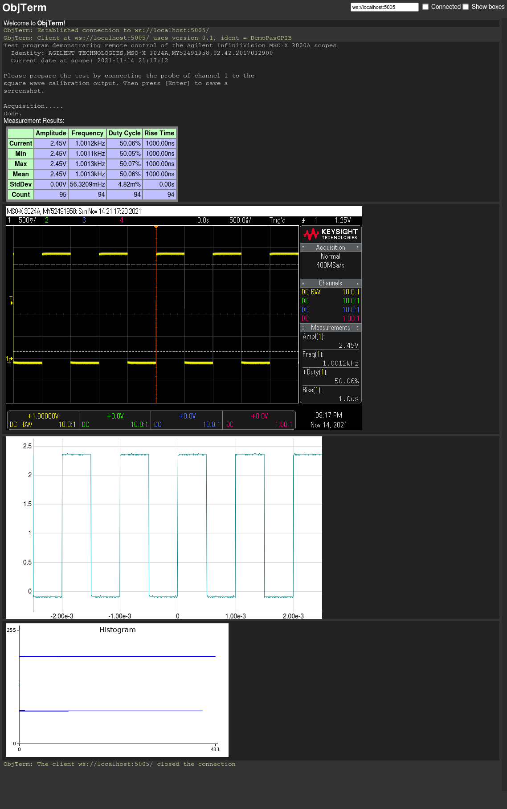
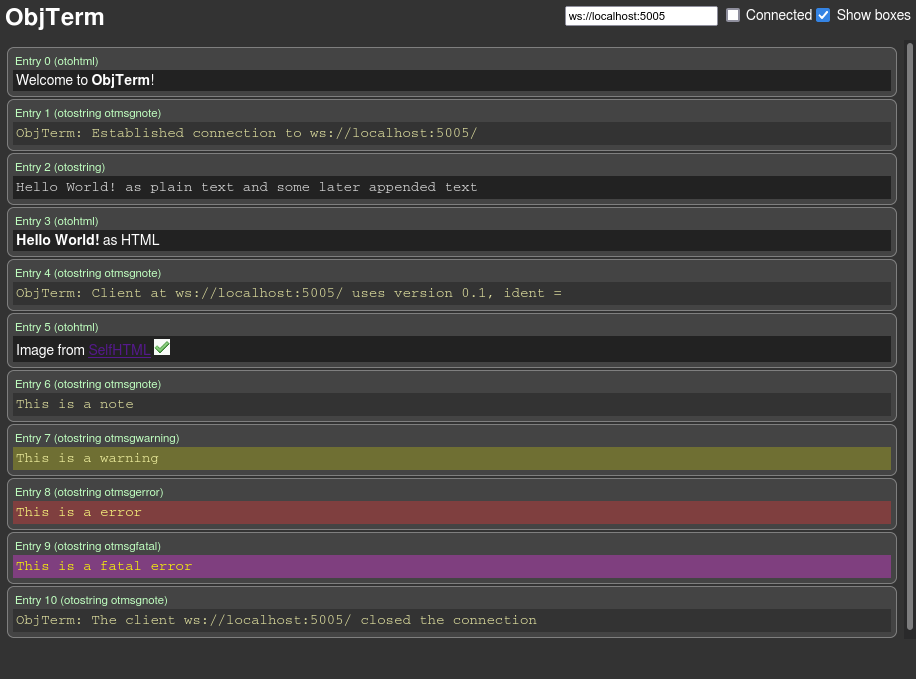
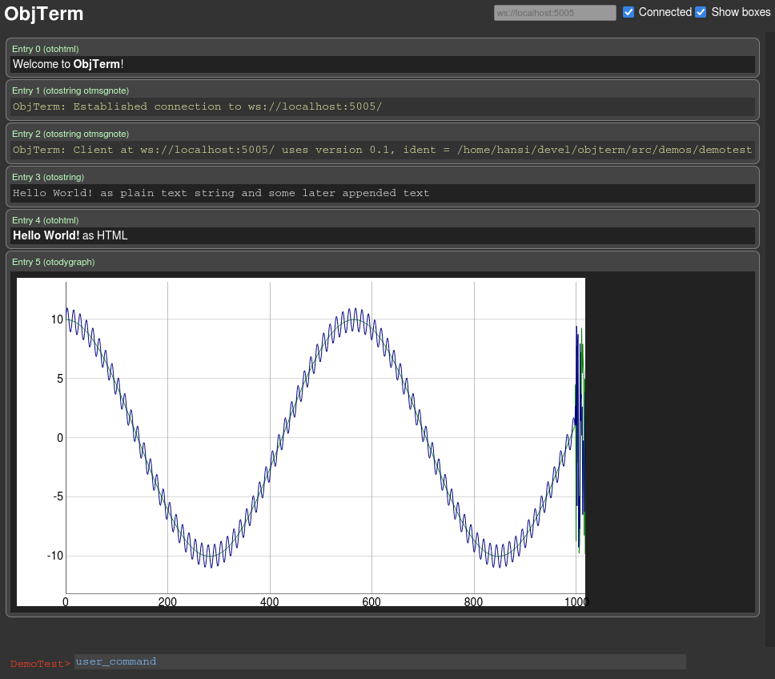
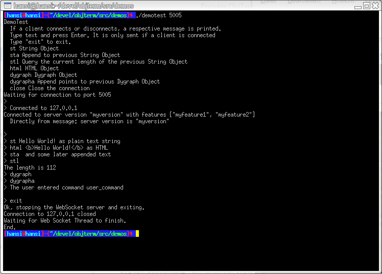
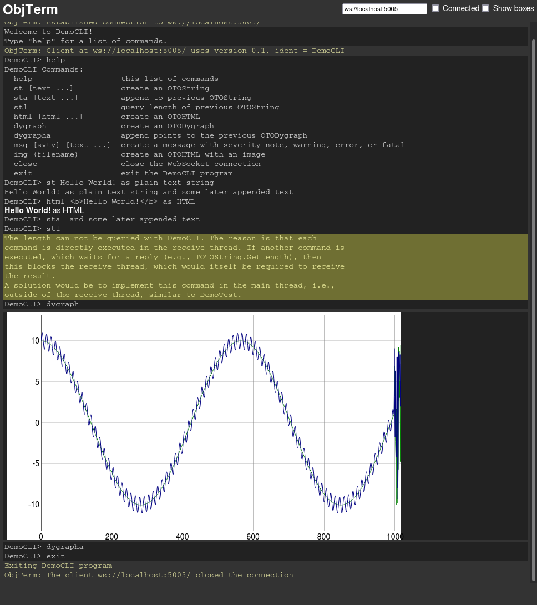
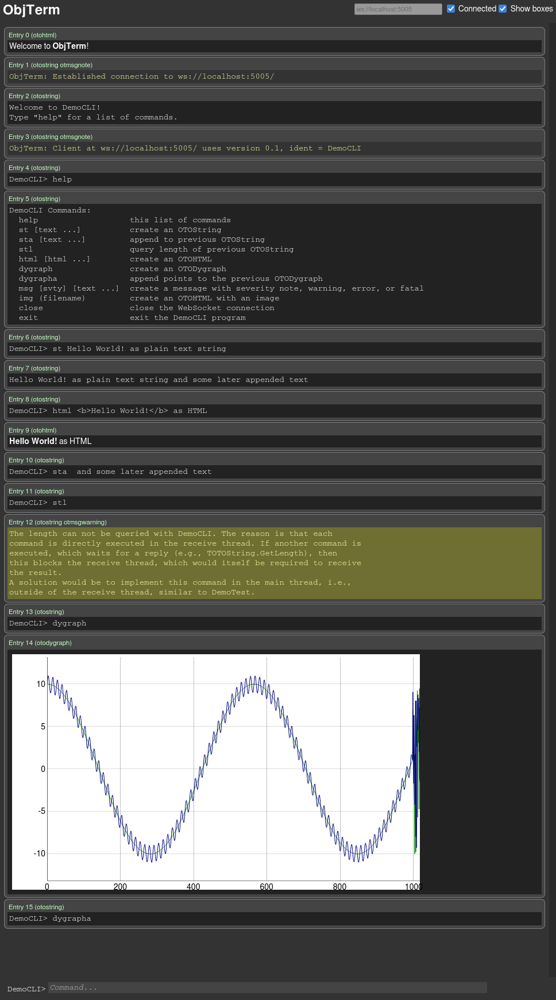

ObjTerm -- Terminal with More Than Text
=======================================

**ObjTerm** is a <ins>terminal</ins> analogous to
[XTERM](https://invisible-island.net/xterm/),
[GNOME Terminal](https://directory.fsf.org/wiki/Gnome-terminal),
[Konsole](https://apps.kde.org/de/konsole/), ..., but it offers more than
showing just text. It can display items like
- plain text,
- HTML,
- images,
- interactive graphs,
- ...

These items are called "objects", hence the name "**ObjTerm**".

<a href="doc/demopasgpib.png"></a>

A **typical application** could be a program, which controls electronic
measurement equipment like scopes, multimeters, ... to perform long lasting
lab measurements over night. For stability reasons, this program should not
have a GUI but run on the command line. To be able to display intermediate
measurement results with tables and graphs, **ObjTerm** is used instead (or in
addition) to the output via stdout to the conventional terminal.

How it Works
============
- **ObjTerm** is a JavaScript application that runs in a browser.
  - Using a browser is a simple way to display all kind of objects and to
    implement interactive behavior using HTML 5 and JavaScript.
- A normal user space program uses **ObjTerm** for its output.
- They communicate via
  [WebSocket](https://datatracker.ietf.org/doc/html/rfc6455).
- [User Space Program] <--(web socket)--> [ObjTerm]
- The program appends objects to the terminal, much like it writes text to
  stdout when using a conventional terminal.
- In addition, it can update existing objects, e.g., add text to a plain text
  object, add data points to graph, add event callbacks to HTML form elements
  (not yet implemented), ...
- The **ObjTerm** also provides a command line input, which sends the user
  input to the program.
- Disclaimer: The current state of development is rather a proof of concept
  than a finished project. See the [TODOs](#todos) section below.
- Disclaimer: Conventional terminals do support a bit more than just text,
  e.g., colors, cursor placement, clear screen, mouse input with GPM, ...,
  and XTerm can even do 
  [graphics](https://stackoverflow.com/questions/2114347/raster-graphics-in-xterm).

Details
=======
- The JavaScript application of **ObjTerm**, which runs in a browser, is
  actually programmed in Pascal and then compiled ("transpiled") to JavaScript
  with [Pas2js](https://wiki.lazarus.freepascal.org/pas2js) of the
  [Free Pascal (FPC)](https://www.freepascal.org/) project.
- This **ObjTerm** terminal side is called "Terminal" or "Server".
- The user space program can be any application, programmed with any language.
  The project currently implementes units for Free Pascal.
- The user space program is called "Program" or "Client".
- The program spawns a background thread for the WebSocket communication. The
  goal is to have no disturbance for the main program.
- Since the two parts communicate via WebSocket, they can be located at
  different hosts.

Installation Instructions
=========================

Prerequisites
-------------
- To compile user space programs (e.g., the demos), the 
  [Free Pascal (FPC)](https://www.freepascal.org/) compiler is required (tested
  with version 3.2.2).
  - The [Lazarus](https://www.lazarus-ide.org/) IDE is not required. However it
    is recommended to use it for development and for building.
- To compile the **ObjTerm** JavaScript application, the
  [Pas2js](https://wiki.lazarus.freepascal.org/pas2js) transpiler is required
  (tested with version 2.0.6). See below for hints how to install and a Lazarus
  integration.
  - A pre-compiled JavaScript file is provided at
    [src/demos/objterm.js](src/demos/objterm.js).

Dependencies
------------
- [LazWebsockets](https://github.com/Warfley/LazWebsockets) is required for the
  program to implement the WebSocket server.
- [Dygraphs](https://dygraphs.com/) is used by the terminal for interactive
  graphs. **ObjTerm** references it from
  https://cdnjs.cloudflare.com/ajax/libs/dygraph/2.1.0/ , so no installation or
  explicit download is required.
- For the DemoPasGPIB, also
  [pas-gpib](https://github.com/hansiglaser/pas-gpib) and
  [pas-libusb](https://github.com/hansiglaser/pas-libusb/tree/libusb-1.0) are required.
- All these dependencies are referenced as
  [Git Submodules](http://git-scm.com/book/en/Git-Tools-Submodules).

Pas2js Hints
------------
- Main Page: https://wiki.lazarus.freepascal.org/pas2js
- Installation Instructions: https://wiki.lazarus.freepascal.org/pas2js#Where_to_get_it
  - Beware, the given download links do not work (any more). I used a
    [mirror](https://mirror.freemirror.org/pub/fpc/contrib/pas2js/2.0.6/pas2js-linux-2.0.6.zip )
    via HTTPS.
- Lazarus Integration: https://wiki.freepascal.org/lazarus_pas2js_integration
  - A special syntax in some units causes Lazarus auto-completion to complain.
    See https://forum.lazarus.freepascal.org/index.php/topic,53977.0.html for a
    solution.

Installation
------------

Clone the Github repository, and recursively clone the [Git
Submodules](http://git-scm.com/book/en/Git-Tools-Submodules).

    git clone --recurse-submodules https://github.com/hansiglaser/objterm.git

If you only cloned the main repository, you can clone the submodules manually.
Some background information on submodules is provided at at
https://gitlab.com/freepascal.org/fpc/pas2js#complete-checkout and the
[pas-gpib README](https://github.com/hansiglaser/pas-gpib#references).

    git clone https://github.com/hansiglaser/objterm.git
    cd objterm/
    git submodule init
    git submodule update
    cd src/demos/pas-gpib
    git submodule init
    git submodule update

Use the Lazarus project file in [`src/terminal/*.lpi`](src/terminal/*.lpi) to
compile (with Pas2js) the terminal, and in [`src/demos/*.lpi`](src/demos/*.lpi)
to compile the demos.


Demos
=====
For testing and demonstration purposes, 4 demo user space programs are
provided. These demos are in directory <a href="src/demos/">`./src/demos/`</a>.

To execute a demo program, you have to provide one command line parameter for
the TCP/IP port, where the WebSocket server should listen, e.g., "`./democli
5005`".

DemoSimple
----------
**DemoSimple** is just a list of the most important commands to demonstrate
them. This program has the port 5005 hard-coded. For more details and the
source code, see below in section [How to Use ObjTerm in Your
Application](#how-to-use-objterm-in-your-application).

<a href="doc/demosimple.png"></a>

DemoTest
--------
**DemoTest** is for quick and dirty testing of the features. It implements a
conventional Command Line Interface with `ReadLn` in the normal shell and
terminal.

**ObjTerm** output in the browser:  

<a href="doc/demotest-browser.png"></a>

Conventional user interface with internal command line in the shell:  

<a href="doc/demotest-shell.png"></a>

Note that the verbose debug output in the shell was disabled for the screenshot.

DemoCLI
-------
**DemoCLI** implements a complete Command Line Interface via **ObjTerm**, i.e.,
the user controls that demo user space program completely via the browser.

The following screenshot shows exemplary **ObjTerm** output in the browser.

<a href="doc/democli-noboxes.png"></a>

After the last command "`exit`", DemoCLI closed the connection and therefore
**ObjTerm** also disables the input line. Therefore it is not visible any more.
See the screenshot of DemoTest above for an exemplary input line (at the bottom of
the page). DemoTest configures the prompt and input in fancy colors for
demonstration purposes.  DemoCLI's input is more modest (see also the next
screenshot).

After every command (i.e., after the user pressed the [Enter] key), **ObjTerm**
sends the command string to DemoCLI. Then  DemoCLI itself prints a line with
the prompt plus the user input to **ObjTerm** as text, e.g. "`DemoCLI> exit`".
Then it executes the command, which shows more objects.

Same **ObjTerm** output with boxes enabled.  
<a href="doc/democli-boxes.png"></a>

These two images show the difference, if the check box "Show boxes" on the top
right is enabled or disabled. Without the boxes, **ObjTerm** looks much more
like a traditional terminal. For better visualization and also
meta-information, the boxes can be enabled.

Note that in the bottom screenshot, the command "`exit`" was not yet executed,
therefore also the input line is still visible.


DemoPasGPIB
-----------
**DemoPasGPIB** controls an oscilloscope with
[pas-gpib](https://github.com/hansiglaser/pas-gpib) via USB or network,
performs a few measurements, and then shows the results in **ObjTerm**.
1. First, a colored HTML table gives waveform measurements and their
   statistics.
2. Second, a screenshot image from the scope (transferred via USB) is shown.
3. Third, the raw acquisition data (also transferred via USB) is plotted as an
   interactive graph. The user can even zoom in.
4. Finally, the user space program DemoPasGPIB dynamically generates an image
   in memory with a histogram of the acqisition data points and shows that.

Before the measurements, DemoPasGPIB waits until the **ObjTerm** has connected
to the program via WebSocket. After the measurements and the output it simply
closes the connection and exits. In other words, the program does not use any
user interaction.

**ObjTerm** output:  
<a href="doc/demopasgpib.png"></a>

DemoGUI
-------
**DemoGUI** is a planned demo but the required features are not yet
implemented. It will show an HTML object with form elements (e.g., buttons,
text input, check boxes, ...), attach callbacks to them, and interact with the
user via these elements.


How to Use ObjTerm Terminal
===========================
To start an **ObjTerm** terminal, simply visit
[src/terminal/objterm.html](src/terminal/objterm.html) with your browser
(tested with Firefox 94.0), e.g., with an URL like
`file:///path/to/objterm/src/terminal/objterm.html`. This HTML file references
`objterm.js` (and the Dygraphs JavaScript library) and automatically starts the
JavaSript application.

To safe you from having to compile **ObjTerm** from Pascal to JavaScript, a
pre-compiled JavaScript file is provided at
[src/demos/objterm.js](src/demos/objterm.js). It is intentionally at
a different directory as `objterm.html` to prevent you from an accidential
execution of JavaScript code without having read that. Please **manually copy**
it to the directory `src/terminal` after cloning the Git repository.

When the browser has displayed the page, then edit the WebSocket URL in the top
to show your application's server URL. Then enable the checkbox "**Connected**".
This initiates the connection via WebSocket. By disabling that checkbox, the
connection is closed.

The checkbox "**Show boxes**" enables and disables the boxes around each
individual **ObjTerm** object. See above the screenshots of [DemoCLI](#democli)
for a visualization of the difference.


How to Use ObjTerm in Your Application
======================================
The use of **ObjTerm** in your own application is simple and straight forward.
Please review the demo programs for an introduction and for templates.

Note that the use of **ObjTerm** does not imply any limitations to your
application. It can continue to use the normal stdout/stdin/stderr. IOW, no
hooks or redirects are activated. It can also implement its own GUI and use
**ObjTerm** in parallel.

The source code of [DemoSimple](#demosimple) (see above) gives a first
impression:

```pascal
Program DemoSimple;
Uses
  {$IFDEF UNIX} CThreads, {$ENDIF}
  Classes, SysUtils, Base64,
  ObjTerm, OTOBase;

Var OT : TObjTerm;
    OS : TOTOString;

Begin
  // create an ObjTerm instance
  OT := TObjTerm.Create(5005);
  // start WebSocket server in background thread
  OT.StartWebSocketServerThread;
  WriteLn('Waiting for connection to port 5005');
  // everything prepared, now wait until the ObjTerm connects
  OT.WaitForConnect;
  // print plain text string
  OS := TOTOString(OT.AppendOTString('Hello World! as plain text'));
  // print HTML
  OT.AppendOTHTML('<b>Hello World!</b> as HTML');
  // add more text to the string from above
  OS.Append(' and some later appended text');
  // query the total length of that text
  WriteLn('The string now has a length of ',OS.GetLength);
  // show an image (using HTML and data URL)
  OT.AppendOTHTML(
    '<p>Image from <a href="https://wiki.selfhtml.org/wiki/Grafik/Grafiken_mit_Data-URI">SelfHTML</a>'#10+
    '');
  OT.AppendOTHTML('');
  // show a message with severity (which is just an TOTOString with predefined formatting)
  OT.AppendMsg(msNote,    'This is a note');
  OT.AppendMsg(msWarning, 'This is a warning');
  OT.AppendMsg(msError,   'This is a error');
  OT.AppendMsg(msFatal,   'This is a fatal error');
  // show an interactive graph
  OG := OT.AppendOTDygraph({... graph data variables ...});
  OG.AppendPoints({... more graph data ...});

  // close connection
  Sleep(100);
  OT.FWSH.CloseAll;
  Sleep(100);
  OT.FWSS.Stop(True);
  OT.Free;
End.
```

More Information
----------------
- `OT.StartWebSocketServerThread` starts a **background thread** with the
  WebSocket server. Therefore this function returns immediately (i.e.,
  it is non-blocking) and the user program can continue to operate as usual in
  the main thread.
- Upon connection, two more threads are started, one for sending, and one for
  receiving. This is handled automatically and only mentioned here for
  completeness.
- Alternatively, `OT.StartWebSocketServer` (i.e., without `Thread`) can be
  used. This implements the WebSocket server. It is blocking. Use that if a
  blocking behavior fits better for your application, e.g., if all
  functionality is implemented in callbacks, as demonstrated with
  [DemoCLI](#democli).
  - This is the very function which is otherwise executed in the background
    thread.
- The functions `TObjTerm.Append*(...)` are a short form for
  `TObjTerm.AppendObj(TOTO*.Create(...))`
  - `TOTO*.Create(...)` creates a Pascal object for the program (client) side
    of the respective **ObjTerm** object.
  - Currently the following Pascal classes are defined for **ObjTerm** objects
    - TOTOString
    - TOTOHTML
    - TOTODygraph
  - `TObjTerm.AppendObj` sends a WebSocket message to **ObjTerm** (i.e., the
    browser) to append the respective object to the terminal.
  - You can set **formatting** for the `TOTO*` objects before it is sent.
    - `TOTO*.FCSSClasses` is an array of strings to specify CSS classes.
      - predefined classes are `otmsgnote`, `otmsgwarning`, `otmsgerror`, and
        `otmsgfatal`
      - `TObjTerm.AppendMsg` is just using this feature to create these
        messages with predefined severity.
    - `TOTO*.FCSSStyle` is a string which is added as `style` attribute to the
      HTML `<div>` element enclosing the **ObjTerm** object. It can be used to
      quickly change the font, color, ...
- All functions `TObjTerm.Append*()` **return** the Pascal object reference to
  the generated `TOTO*` class (see above for `AppendOTString`).
  - You can use that for later **updates** or other **interaction** with the
    **ObjTerm** object.
  - Currently the following functions are supported:
    - `TOTOString.Append`
    - `TOTOString.GetLength`
    - `TOTODygraph.AppendPoints`
  - It is a memory leak, if these are not `.Free`d. Please note that the demos
    are not yet clean with this regard.
- **Images** are actually HTML objects with `` with a data URL.
  - You can use the function `EncodeStringBase64` to encode your image data.
  - See [DemoCLI](#democli) and [DemoPasGPIB](#demopasgpib) for examples.
- **Interactive graphs** use the JavaScript library
  [Dygraphs](https://dygraphs.com/).
  - See the extensive documentation on its usage and options at their web page.
  - See [DemoTest](#demotest) and [DemoCLI](#democli) for examples for the
    options and how to format and provide the data.
- Beside the functions shown above, **Callbacks** for many events can be
  registered. With these, even more powerful applications are possible.
  - See [DemoTest](#demotest) for examples for all callbacks.
  - See [DemoCLI](#democli) for a "real world usage" of some callbacks, and
    especially procedure `CliCmdStl` for an explanation of limitations.
  - Beware: The callbacks are executed in the executed in the background,
    sending, or receiving tasks. Be sure to consider proper measures for
    synchronization and concurrency.


Concept
=======

This section will provide the underlying concepts and design decisions of **ObjTerm**

**TODO**


Contributing
============

This section will provide information how to contribute to both, the
**ObjTerm** terminal application, as well as the Pascal units for the user
space application.

Unsorted information
--------------------
  - The communcation via WebSocket is formatted as JSON object

**TODO**


TODOs
=====
- fill the remaining sections above
- future extension: attach callbacks to HTML elements --> implement full GUI
  for [DemoGUI](#demogui)
- create Makefiles so that building without Lazarus is possible
- many more smaller and larger improvements

